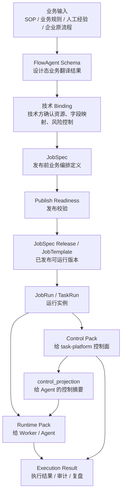
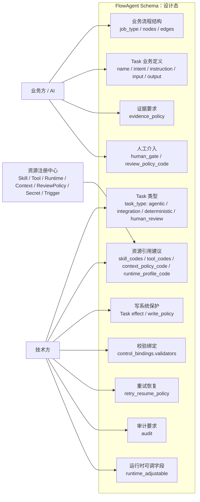
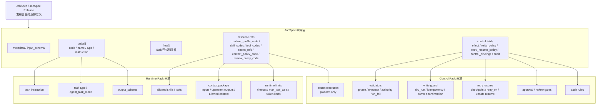
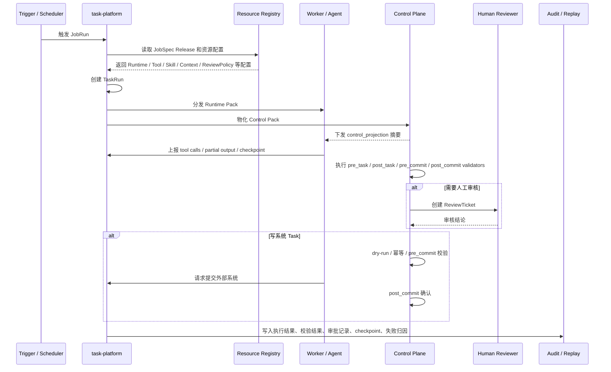

# FlowAgent Schema 字段填写与运行时分发流向图

> 这张图说明：业务翻译平台产出的 FlowAgent Schema 里，各类字段应该由谁填写；发布后，这些字段如何被编译进 JobSpec；运行时又如何分别进入 Runtime Pack、Control Pack、control_projection 和审计复盘。

## 1. 总体流向图



## 2. FlowAgent Schema 里应该填写什么



## 3. 编译成 JobSpec 后，哪些字段去哪里



## 4. 运行时分发图



## 5. 一句话理解

```text
FlowAgent Schema 负责表达“当前业务怎么做、怎么验收、哪里有风险”。
JobSpec 负责冻结“这次发布具体怎么编排、引用哪些资源、有哪些控制字段”。
Runtime Pack 负责告诉 Worker / Agent “当前 Task 怎么执行”。
Control Pack 负责告诉平台控制面 “当前 Task 怎么校验、审批、审计、防事故和恢复”。
Execution Result 负责记录 “最后发生了什么，以及为什么”。
```

