# 架构全景

> 最后更新：2026-04-23（v3）
>
> 本文档是整个产品的**架构北极星**——不是功能细节，而是定位、结构、数据流、执行模型、演进路径。
> 所有子文档的设计决策都应该回到这张图上对齐。
>
> 子文档索引：
> - FlowAgent PRD（功能细节）→ [`flowagent-product.md`](./flowagent-product.md)
> - 产品矩阵（四件套定位）→ [`product-matrix.md`](./product-matrix.md)
> - 产品战略（知识容器、Gene 飞轮）→ [`product-strategy.md`](./product-strategy.md)
> - 上下文架构（六层模型、Context Bus）→ [`context-architecture.md`](./context-architecture.md)
> - Skill 平台架构（切割原则、双形态）→ [`skill-architecture-thinking.md`](./skill-architecture-thinking.md)
> - Prompt 架构 → [`prompt-architecture.md`](./prompt-architecture.md)
> - 代码级技术架构 → [`flowagent-architecture.md`](./flowagent-architecture.md)

---

## 一、定位与核心判断

### 1.1 一句话定义

**FlowAgent 是企业级 Agent Operating Infrastructure 的产品化表达——通过上下文操作系统、可控执行内核、安全治理织网与反馈学习飞轮，把概率型模型能力转化为可审计、可控、可进化的工业级任务执行系统。**

对用户来说是一个产品（统一入口、统一体验）。
对技术架构来说是六个子系统（解耦、独立演进、总线串联）。

### 1.2 核心判断

企业 Agent 化的瓶颈已经不在模型能力，而在**任务执行系统**。

传统大模型应用栈是 `Prompt + Model + Tools`，适合单轮增强。复杂流程任务需要升级为：

```
Context Operating System        上下文治理
+ Skill Fabric                  能力供给
+ Execution Kernel              可控执行
+ Governance Fabric             安全审计
+ Learning Flywheel             反馈进化
```

这不是 LLM 应用架构的优化，而是一次范式升级——从「LLM 应用」升级为「Agent Infra」。

### 1.3 五大企业级挑战与架构回答

| 挑战 | 具体表现 | 架构回答 | 对应子系统 |
|------|---------|---------|-----------|
| **高准确率** | AI 单步 85-90%，5 步串联降至 59% | Context OS + Skill Fabric + Gene 飞轮 | 3.1 + 3.2 + 3.6 |
| **高可控性** | 企业流程不允许"自由探索"，需要约束边界 | 双引擎执行 + 约束引擎 + 人类干预锚点 | 3.4 |
| **安全合规** | PII 泄露、越权操作、不可逆动作 | 零信任安全 + PII 网关 + 执行沙箱 | 3.5 |
| **可审计** | 出问题后必须定位是 Prompt/模型/Skill/策略哪个环节 | 全链路 Trace + 四元版本绑定 | 3.5 |
| **可进化** | 不能每次改 Prompt 手动优化，需要自动学习 | Gene 进化循环 + 三层评估 + 失败蒸馏 | 3.6 |

### 1.4 战略定位升维

| 层级 | 定位 | 类比 |
|------|------|------|
| 第一层（当前） | Skill 平台 — 能力编排底座 | npm registry |
| 第二层（升级中） | Agent Execution Infrastructure — 复杂任务执行底座 | Kubernetes |
| 第三层（终局） | Enterprise Agent Operating System — 企业 Agent 操作系统 | Linux |

---

## 二、全景架构图

### 2.1 总体架构

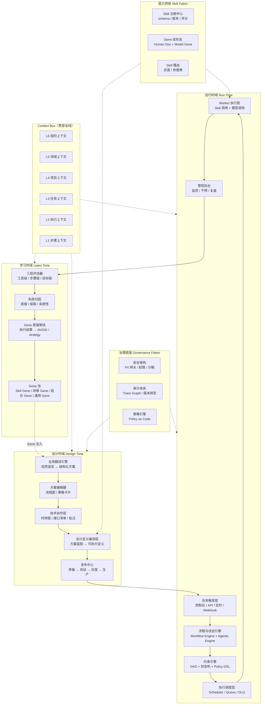

### 2.2 架构阅读指引

**三个时域**——设计时产出方案蓝图，运行时执行任务，学习时蒸馏经验。三者形成闭环：学习时域的 Gene 输出反哺设计时域的 AI 翻译。

**Context Bus**——不是消息队列，是分层的、带生命周期管理的状态存储。六层上下文从组织（年级）到步骤（秒级），贯穿三个时域。

**Skill Fabric**——独立于三个时域之外的能力供给网络。设计时被编译层引用，运行时被 Worker 调用，学习时产出 Skill Gene。

**治理底座**——安全、审计、策略三条横切关注点，渗透到设计时和运行时的每个环节。

---

## 三、六大子系统

### 3.1 Context OS — 上下文操作系统

> 一句话：管理业务上下文从意图到落地到学习的完整生命周期。Agent 不是主角，上下文才是主角。

#### 六层上下文模型

| 层级 | 内容 | 生命周期 | 谁写入 | 谁读取 |
|------|------|---------|--------|--------|
| **L6 组织** | 企业文化、行业、底线 | 年级 | 管理员 | 所有 AI 调用（通用 Gene） |
| **L5 领域** | Gene 池、方案模板、行业知识 | 月级 | Gene 蒸馏管线 | AI 翻译（匹配注入） |
| **L4 项目** | 项目目标、跨 Task 依赖、资源约束 | 周/月级 | 编辑器 + 管控后台 | 执行引擎 + 管控后台 |
| **L3 任务** | 当前 Task 目标、策略、约束、进度 | 天/周级 | 编辑器 + 管控后台 | 执行引擎 |
| **L2 执行** | 当前 Execution 状态、中间结果、决策轨迹 | 小时级 | 执行引擎 | 管控后台 + 复盘 |
| **L1 步骤** | 当前步骤输入/输出、Skill 调用参数 | 秒/分级 | 执行引擎 + Skill | 下一步 Skill + 评估 |

#### Context Bus 四职责

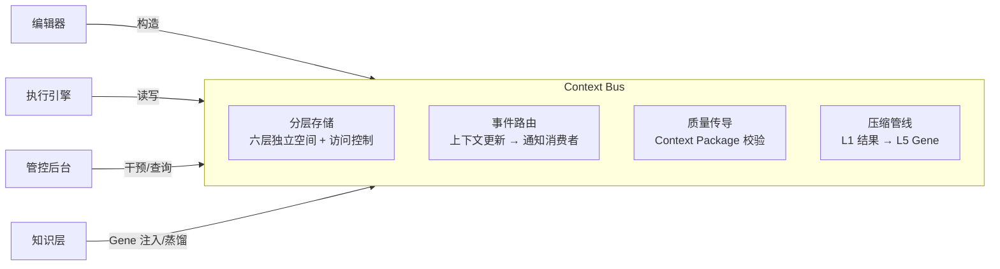

**分层存储**：每层有独立的存储空间、写权限、读权限。L6 持久化极少更新，L1 临时高频读写。

**事件路由**：L4 项目预算变更 → 自动通知关联 L3 任务检查约束 → 通知管控后台 → 通知执行引擎。

**质量传导**：节点交接时校验 Context Package 是否满足下游最低要求（详见 3.1.1）。

**压缩管线**：L1 步骤结果（大量、低密度）→ L2 执行摘要 → L3 任务经验 → L5 Gene（少量、高密度）。

#### 3.1.1 Context Package — 上下文交接契约

传统节点交接只传数据，导致质量信号丢失。Context Package 在每次交接时携带四个维度：

```
Context Package = {
  data:             核心业务数据
  quality_signals:  置信度、精度、完整率、已知局限
  assumptions:      上游依据的前提假设
  trace:            关键决策和备选方案记录（归因用）
}
```

质量传导层在交接时自动校验，策略可配置为 strict（中断）、warn（警告继续）、pass（透传）。

> 完整设计见 [`context-architecture.md`](./context-architecture.md)。

#### 接口

| 方向 | 对接子系统 | 传递内容 |
|------|-----------|---------|
| ← 写入 | Design Studio | L3-L4 上下文结构（方案定义） |
| ← 写入 | Execution Kernel | L1-L2 执行状态和步骤结果 |
| ← 写入 | Learning Flywheel | L5 Gene 和方案模板 |
| → 读取 | Design Studio | Gene + 模板参考（AI 翻译时） |
| → 读取 | Execution Kernel | 上下文注入（每个决策点） |
| → 读取 | 管控后台 | 状态查询（进度监控） |

#### 当前状态与缺口

| 状态 | 说明 |
|------|------|
| 概念设计完成 | 六层模型、Context Package、质量传导层已定义 |
| 缺口：检索策略 | Gene 池规模变大后需要多路召回（向量 + 标签 + 规则），当前仅 keywords 匹配 |
| 缺口：实现路径 | Phase 1 用前端 Zustand 分层管理，Phase 2 服务端数据库，Phase 3 事件驱动架构 |

---

### 3.2 Skill Fabric — 能力供给网络

> 一句话：不是工具目录，而是以"业务可验收"为边界的能力操作系统，每个 Skill 同时拥有给人看的文档和给模型用的 Gene。

#### Skill 切割原则

```
一个 Skill 的边界 = 从上一个"业务方能看懂并验收的输出"
                    到下一个"业务方能看懂并验收的输出"
```

Skill 不是"最小技术单元"，而是"最小业务验收单元"。内部可能包含多个技术步骤，但对外是黑盒。

#### Gene 双形态

每个 Skill 在知识库中有两种表达形态：

| | Human Doc（给人看） | Model Gene（给模型用） |
|---|---|---|
| **设计目标** | 完整性、可理解性、可审计 | 控制密度、可匹配、可进化 |
| **内容结构** | overview + workflow + examples + API notes | keywords + summary + strategy + AVOID |
| **典型长度** | 500-3000 token | 100-300 token |
| **谁消费** | 技术方（编辑器/管控后台） | AI（生成方案时注入 prompt） |

基于 EvoMap/清华 Gene 研究（2026）：完整文档（~2500 token）注入模型后性能低于无指导基线，Gene（~230 token）稳定高于基线。关键在于形态：strategy > summary > overview，AVOID 警告的控制效果最强。

#### Skill 在两种执行模式中的角色

| 维度 | Workflow（绑定） | Agentic（授权） |
|------|-----------------|----------------|
| 关系 | 节点绑定 Skill（1:1） | 任务授权 Skill 列表（1:N） |
| 决定时机 | 设计时确定 | 设计时授权 + 执行时选择 |
| 用户决策 | "这步用哪个 Skill" | "给不给 Agent 这个能力" |
| Agent 自主性 | 无——按图执行 | 有——自主选择调用 |

#### 热替换与灰度

方案节点绑定的是逻辑名（`compliance-check`），Skill 平台维护逻辑名到具体版本的解析规则表。支持灰度发布（30% 流量用新版）和一键回退。前提条件：输入/输出 schema 向后兼容。

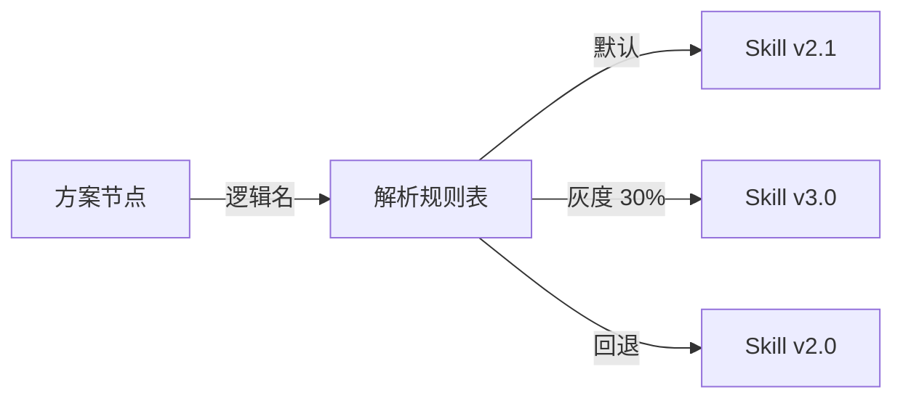

#### 三层可见性

| 层级 | 来源 | 可见范围 |
|------|------|---------|
| 平台通用 | 平台方创建维护 | 所有企业 |
| 社区共享 | 企业上传的非敏感 Skill | 所有企业（可付费） |
| 企业私有 | 企业内部开发 | 仅该企业 |

#### 接口

| 方向 | 对接子系统 | 传递内容 |
|------|-----------|---------|
| → 供给 | Design Studio（编译层） | Skill schema + 推荐匹配 |
| → 供给 | Execution Kernel（Worker） | Skill 运行时调用 |
| ← 反馈 | Learning Flywheel | Skill Gene 更新（strategy/AVOID） |
| ← 注册 | 企业技术方 | 新 Skill 注册 + 版本管理 |

#### 当前状态与缺口

| 状态 | 说明 |
|------|------|
| 架构设计完成 | 切割原则、双形态、热替换、灰度机制已定义 |
| Mock 可用 | 8 个 Mock Skill 在编辑器中展示 |
| 缺口：Skill 评分路由 | Agentic 场景多 Skill 可选时，缺少智能路由（加权评分 / MAB） |
| 缺口：Skill 生命周期管理 | 开发 → 测试 → Shadow → 灰度 → 正式 → 退役的完整门禁 |

> 完整设计见 [`skill-architecture-thinking.md`](./skill-architecture-thinking.md)。

---

### 3.3 Design Studio — 设计工作台

> 一句话：把业务方脑子里的想法翻译成结构化的可执行方案，同时沉淀企业私有业务知识。

#### 四个组成部分

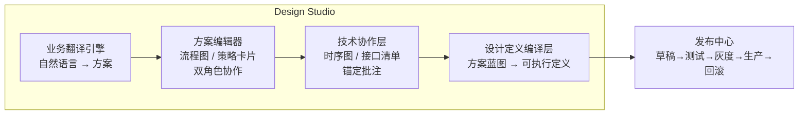

**业务翻译引擎**：用户输入自然语言 → AI 判断任务类型（Workflow/Agentic/Hybrid）→ 注入匹配的 Gene + 方案模板 → 生成结构化方案。需求模糊时弹出澄清卡片。

**方案编辑器**：
- Workflow → 详细流程图（确定性步骤 + 人机分工标注）
- Agentic → 策略卡片（目标 + 简化流程图 + 约束 + 成功标准）
- 双角色协作：业务方描述需求 + 技术方审核确认
- 不确定的节点标记黄/红点（confidence），不拦截用户

**技术协作层**：编辑器内嵌 Tab 切换，提供技术时序图（Mermaid）、接口/能力清单（需要的 vs 已有的）、节点级技术详情。锚定批注自动蒸馏为 Gene。

**设计定义编译层**（规划中）：把方案蓝图自动"编译"为可执行的 Workflow/Task 定义——自动绑定 Skill、生成参数映射、注入约束。这是从"参考蓝图手动搭建"到"自动生成可执行定义"的关键跳板。

**发布中心**（规划中）：管理方案从草稿到生产的完整生命周期，支持测试环境验证、灰度发布、一键回滚。和 Skill 级灰度互补——Skill 灰度解决能力升级，方案灰度解决流程变更。

#### 接口

| 方向 | 对接子系统 | 传递内容 |
|------|-----------|---------|
| ← 读取 | Context OS | Gene + 模板参考（AI 翻译时注入） |
| ← 读取 | Skill Fabric | 可用 Skill 列表 + schema（推荐匹配） |
| → 输出 | Context OS | L3-L4 上下文结构（方案定义） |
| → 输出 | Execution Kernel | 可执行定义（经编译层处理） |
| → 输出 | Learning Flywheel | 方案 Diff（AI 初版 vs 用户终版）+ 批注蒸馏 |

#### 当前状态与缺口

| 状态 | 说明 |
|------|------|
| Demo 可用 | AI 翻译、流程图编辑、策略卡片、反问标记、确认方案 |
| 缺口：编译层 | 当前输出是方案蓝图 JSON，技术方参考手动搭建，无自动编译 |
| 缺口：发布中心 | 方案生命周期只到"确认"，缺少测试→灰度→生产→回滚 |
| 缺口：后端 | 无用户系统、无数据持久化、无真实协作流程 |

> 功能细节见 [`flowagent-product.md`](./flowagent-product.md)。

---

### 3.4 Execution Kernel — 执行内核

> 一句话：把确定性流程和动态决策统一在一个受约束的执行框架中——LLM 不拥有最终执行权。

#### 双引擎架构

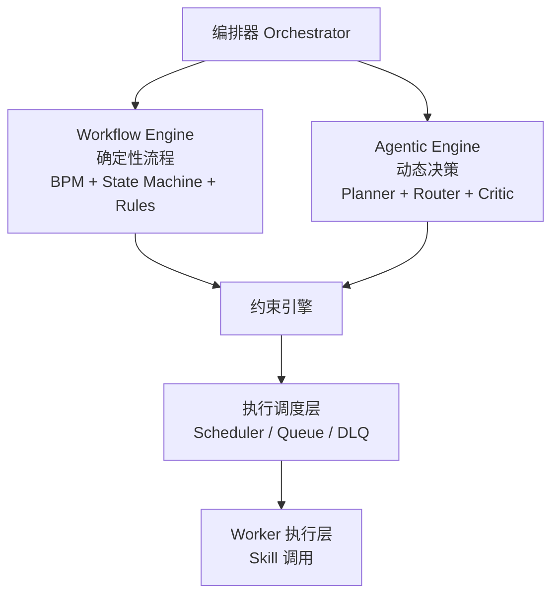

**Workflow Engine** 适合金融审批、医疗流程、制造工单——稳定优先，按确定性路径执行。

**Agentic Engine** 适合策略任务、创意任务——包含 Planner（规划）、Router（路由）、Critic（评估）、Memory、Tool Runtime。

**Hybrid 模式（推荐主路径）**：80% 流程节点由 Workflow 控制，20% 复杂节点由 Agentic 执行。Agent 在约束边界内创新，不是让 Agent 统治流程。

#### 约束引擎——三层约束

这是整个平台最核心的组件，也是企业级与消费级最大的差异。

**第一层：Task DAG**

控制合法后继节点、非法跳转、重试策略、异常回撤（补偿回滚）。本质是有限执行边界。

**第二层：状态机**

`draft → reviewing → approved → execute`，非法状态跳转禁止。适合审批、医疗、制造等场景。

**第三层：Policy Constraint DSL**

```yaml
policy:
  if:
    risk_level: high
  then:
    require_human_approval: true

  if:
    confidence: < 0.85
  then:
    fallback: expert_review
```

Agentic Engine 的规划受约束引擎管控——LLM 生成候选动作，约束引擎过滤非法动作，只有合法动作集才能进入执行：

```
Action Proposal → Policy Check → Valid Action Set → Execution
```

#### 执行调度层（规划中）

从工程架构图引入，覆盖工业化必需的调度能力：

| 组件 | 职责 |
|------|------|
| Scheduler | 定时任务、周期性执行 |
| Queue | 并发任务排队、优先级 |
| DLQ（死信队列） | 失败任务隔离、重试策略 |
| Rate Limiter | Skill/API 过载保护 |

#### 四层热更新

运行中的调整按风险分层，低层可热更新，高层必须版本化：

| 层级 | 调整内容 | 风险 | 更新方式 | 操作位置 |
|------|---------|------|---------|---------|
| **Layer 1** | 约束/红线 | 最低 | 立即热生效 | 管控后台 |
| **Layer 2** | 策略参数（比例、阈值） | 低 | 下轮生效 | 管控后台 |
| **Layer 3** | Skill 替换/升级 | 中 | Skill 热替换（需 schema 兼容） | 管控后台 + Skill 平台 |
| **Layer 4** | 编排结构（增删步骤） | 高 | 新版本部署 | Design Studio 编辑器 |

核心原则：**参数可以热调，结构必须版本化。**

#### 人类干预锚点

| 类型 | 时机 | 场景 |
|------|------|------|
| **pre-action approval** | 执行前审批 | 高风险动作：写库、医疗建议、资金操作 |
| **in-flight intervention** | 中途挂起 | pause → human review → resume from checkpoint |
| **post-decision review** | 事后抽检 | 审阅和质量监控 |

Checkpoint 机制支持从任意节点恢复：状态快照 + 上下文快照 + 工具状态快照。

#### 接口

| 方向 | 对接子系统 | 传递内容 |
|------|-----------|---------|
| ← 输入 | Design Studio（发布中心） | 可执行定义 |
| ← 读取 | Context OS | 上下文注入（每个决策点） |
| ← 调用 | Skill Fabric | Skill 运行时 API |
| → 输出 | Context OS | L1-L2 执行状态和步骤结果 |
| → 输出 | Learning Flywheel | 执行日志 + 失败记录 |
| ↔ 交互 | 管控后台 | 状态推送 / 人工确认 / 异常处理 |

#### 当前状态与缺口

| 状态 | 说明 |
|------|------|
| 规划中 | 管控后台 Demo 可用（Mock 数据），执行引擎未实现 |
| 缺口：约束引擎 | Task DAG + 状态机 + Policy DSL 需要设计实现 |
| 缺口：调度层 | Scheduler / Queue / DLQ 未设计 |
| 缺口：Checkpoint 恢复 | 状态快照机制未设计 |

---

### 3.5 Governance Fabric — 治理织网

> 一句话：安全、审计、策略三条横切关注点，渗透到设计时和运行时的每个环节。

#### 3.5.1 安全架构（规划中）

**PII 脱敏网关**：所有数据先过安全代理，模型不见原始 PII。

```
Source System → PII Gateway → Tokenization/Masking → Agent Runtime
```

策略包括：静态脱敏、动态脱敏、字段级 tokenization（如 `张三 → PATIENT_001`）。

**四维授权**：不只控制用户，还控制 Agent 和 Skill。

| 维度 | 控制什么 |
|------|---------|
| User | 用户能看到什么、能操作什么 |
| Agent | Agent 能调用哪些 Skill、访问哪些数据 |
| Skill | Skill 能访问哪些外部系统、哪些字段 |
| Data Object | 哪些数据对象可以被哪些主体访问 |

Capability Token：最小权限，有效期限制（"该 token 仅允许调用 skillA，访问字段 X，有效期 30 分钟"）。

**执行沙箱**：Skill 运行在容器沙箱中（network egress 限制、filesystem 限制、syscall 限制），高风险技能用微 VM 隔离。

#### 3.5.2 审计体系

**全链路 Trace Graph**：每次任务生成 TraceID，记录原子步骤：

```
Trace
  ├─ Prompt 版本
  ├─ Model 版本
  ├─ Retrieval evidence
  ├─ Skill 调用链
  ├─ 决策记录
  ├─ Human 审批记录
  └─ 最终输出
```

**四元版本绑定**：每次执行必须绑定 Prompt 版本 x Model 版本 x Skill 版本 x Policy 版本。出了问题可以精确定位是哪个版本的哪个组件导致的。

#### 3.5.3 策略引擎

Policy as Code：用声明式语言定义执行策略，版本化管理，审计可追溯。

#### 接口

治理织网是横切关注点，渗透到其他五个子系统：

| 对接子系统 | 治理职责 |
|-----------|---------|
| Context OS | 数据访问控制、PII 脱敏 |
| Skill Fabric | Skill 权限、沙箱隔离 |
| Design Studio | 方案审计、版本记录 |
| Execution Kernel | 执行授权、Trace 记录、Policy 校验 |
| Learning Flywheel | Gene 入库审计、训练数据合规 |

#### 当前状态与缺口

| 状态 | 说明 |
|------|------|
| 原则已定义 | 数据隔离、最小暴露、审计可追溯（`flowagent-product.md` 2.4） |
| 基础权限已有 | 管控后台四级角色（业务方/主管/技术方/管理员） |
| 缺口：PII 网关 | 未设计 |
| 缺口：Agent/Skill 粒度权限 | 当前只控制用户，未控制 Agent 和 Skill |
| 缺口：执行沙箱 | 未设计 |
| 缺口：全链路 Trace | 未实现 |
| 缺口：四元版本绑定 | 未设计 |

---

### 3.6 Learning Flywheel — 学习进化飞轮

> 一句话：把执行经验压缩为高密度控制资产（Gene），让系统越用越聪明。这是 Agent Infra 的护城河。

#### 三层自进化

| 层次 | 机制 | 输入 | 输出 |
|------|------|------|------|
| **记忆** | 记住用户改了什么 | AI 初版 vs 用户终版 Diff | 下次同类场景不犯同样错 |
| **归纳** | 从个案中提炼规则 | 多次修正中的共性模式 | 通用规则（如"涉及资金操作默认人工"） |
| **判断** | 知道什么时候该问 | 积累的规则 + 案例 | 主动质疑不合理的需求 |

#### Gene 进化循环

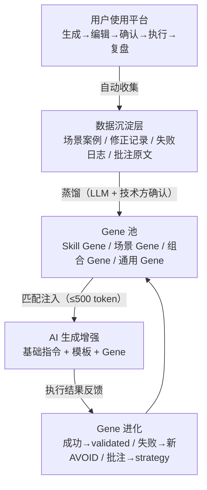

**Gene 四种类型**：

| 类型 | 作用域 | 示例 | 注入条件 |
|------|--------|------|---------|
| Skill Gene | 单个 Skill | "单证 OCR 不要混用扫描件和电子 PDF" | 该 Skill 被匹配到时 |
| 场景 Gene | 某类场景 | "报关场景必须校验 HS 编码位数" | 场景标签匹配时 |
| 组合 Gene | 跨节点/跨 Task | "单证解析→合规校验：解析精度必须≥10 位" | 两个关联节点同时出现时 |
| 通用 Gene | 全局 | "涉及客户沟通的步骤默认人工确认" | 始终注入 |

**Token 预算分配**（总预算 ≤ 500 token）：

```
通用 Gene  ≤ 100 token（始终注入）
组合 Gene  ≤ 150 token（关联节点同时出现时）
场景 Gene  ≤ 150 token（场景匹配时）
Skill Gene ≤ 100 token（Skill 匹配时）
```

#### 三层评估体系

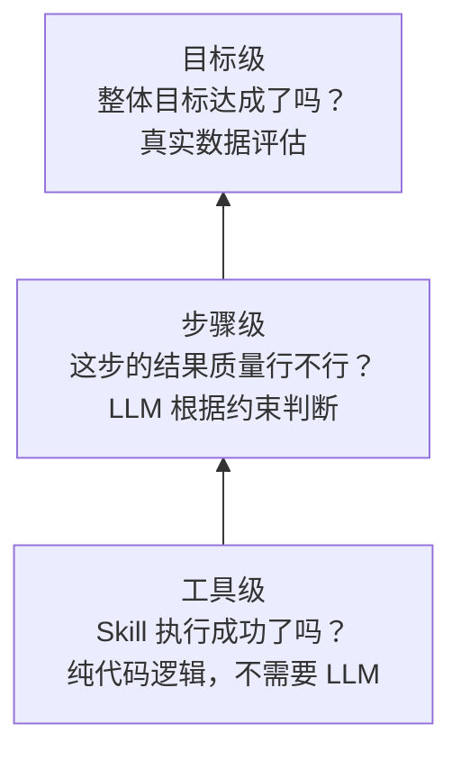

从下往上：工具做对了 → 步骤结果有用 → 目标逐步达成。
从上往下：目标没达成 → 定位哪个步骤 → 定位哪个工具。

评估器双轨运行：**Rule Judge**（规则正确性）+ **LLM Judge**（业务质量），同时满足才算通过。低于阈值：replan → re-execute → escalate human。

#### 三类失败归因

| 类型 | 特征 | 归因难度 | 沉淀为 |
|------|------|---------|--------|
| **直接失败** | 某个节点自身出错 | 低 | Skill Gene (AVOID) |
| **级联失败** | 上游质量不够，下游"通过"但实际不对 | 高 | 组合 Gene (strategy) |
| **系统性失败** | 编排方式或 Agent 组合本身有问题 | 极高 | 场景 Gene (strategy) |

级联失败是最难发现的——每步评估都"通过"，但最终结果不对。Context Package 的 `quality_signals` 是解决这个问题的关键。

#### 接口

| 方向 | 对接子系统 | 传递内容 |
|------|-----------|---------|
| ← 输入 | Execution Kernel | 执行日志 + 失败记录 |
| ← 输入 | Design Studio | 方案 Diff + 批注原文 |
| → 输出 | Context OS（L5） | Gene 和方案模板 |
| → 输出 | Skill Fabric | Skill Gene 更新 |

#### 当前状态与缺口

| 状态 | 说明 |
|------|------|
| 概念设计完成 | 三层进化、Gene 循环、三层评估、失败归因已定义 |
| 缺口：实现 | 当前手动准备 few-shot 示例，无自动蒸馏 |
| 缺口：Rule Judge | 未实现 |
| 缺口：Golden Dataset | 缺少 Skill 级/Workflow 级/边缘 case 的黄金测试集 |

> 完整设计见 [`product-strategy.md`](./product-strategy.md)。

---

## 四、三条数据管线

三条管线形成闭环：设计管线产出方案 → 执行管线运行任务 → 学习管线蒸馏经验 → 反哺设计管线。

### 4.1 设计管线

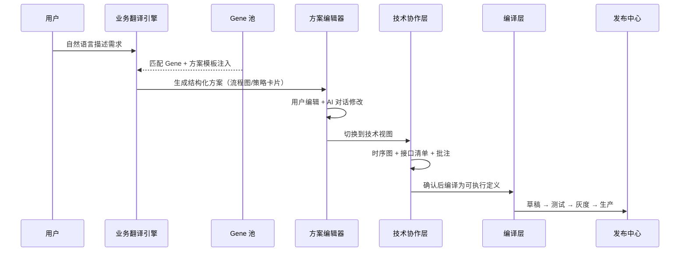

### 4.2 执行管线

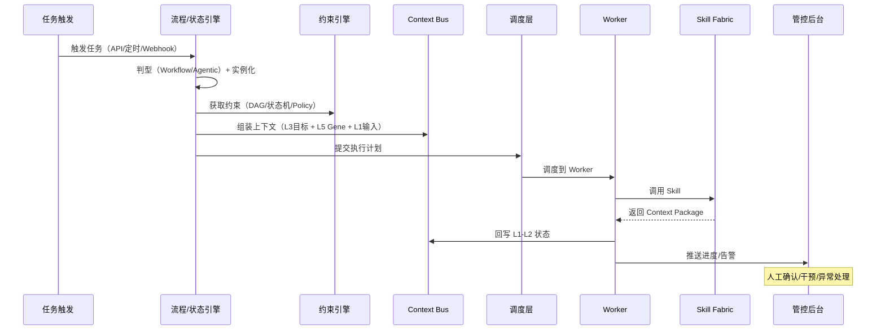

### 4.3 学习管线

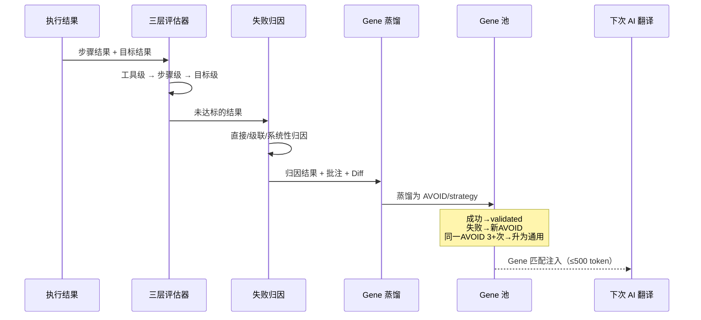

### 4.4 三管线闭环

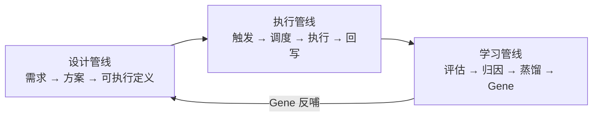

---

## 五、统一执行模型

### 5.1 本质区别：上下文解析时机

Workflow 和 Agentic 的真正区别不是"确定 vs 灵活"，而是**上下文解析的时机不同**。

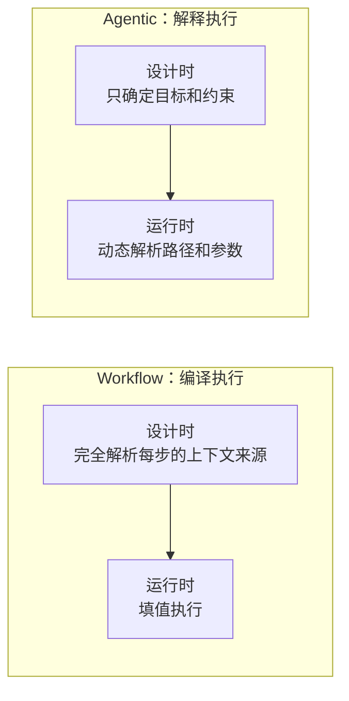

**Workflow（编译执行）**：设计时确定了"步骤 3 的输入 = 步骤 2 的输出字段 A + 步骤 1 的输出字段 B"。运行时只是"填值"。

**Agentic（解释执行）**：设计时只确定了"阶段 3 的目标 = 生成符合品牌调性的内容"。运行时才根据上一步的输出决定"用哪个 Skill、什么参数"。

### 5.2 全维度对比

| 维度 | Workflow（编译执行） | Agentic（解释执行） |
|------|--------------------|--------------------|
| **上下文注入** | 设计时确定的固定模板 | 运行时动态组装 |
| **Skill 关系** | 绑定（1:1，设计时确定） | 授权（1:N，执行时选择） |
| **失败归因** | 容易——路径确定，沿路径追溯 | 难——路径不确定，需回溯决策点 |
| **质量传导** | 设计时预定义契约 | 运行时评估 + 复盘后固化 |
| **人工介入** | 节点级确认（verify/input/decision） | 策略级干预（预算/方向/约束） |
| **热更新重点** | 主要更新参数（Layer 1-2） | 可更新策略、Skill、甚至目标 |
| **优化主战场** | 编辑器（改结构） | 管控后台（改参数） |
| **Gene 匹配** | 精确匹配（这步绑定哪个 Skill） | 范围匹配（可以授权哪些 Skill） |
| **L3+ 上下文** | 运行时基本不变 | 运行时都可能更新 |

### 5.3 Hybrid 模式

大部分真实业务是混合型——80% 确定性节点由 Workflow Engine 控制，20% 复杂节点由 Agentic Engine 执行。

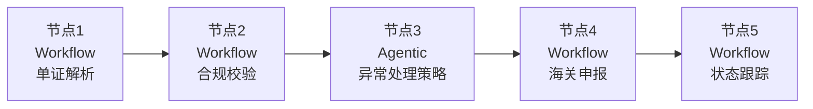

节点 3 是 Agentic 节点——海关驳回的原因复杂，需要 Agent 自主判断处理策略。其余节点是确定性的 Workflow 节点。

对用户来说不需要理解 Workflow 和 Agentic 的区别——他们看到的都是"有结构的方案 + 人机分工"。

---

## 六、四级层次模型

### 6.1 Project → Task → Scheme → Execution

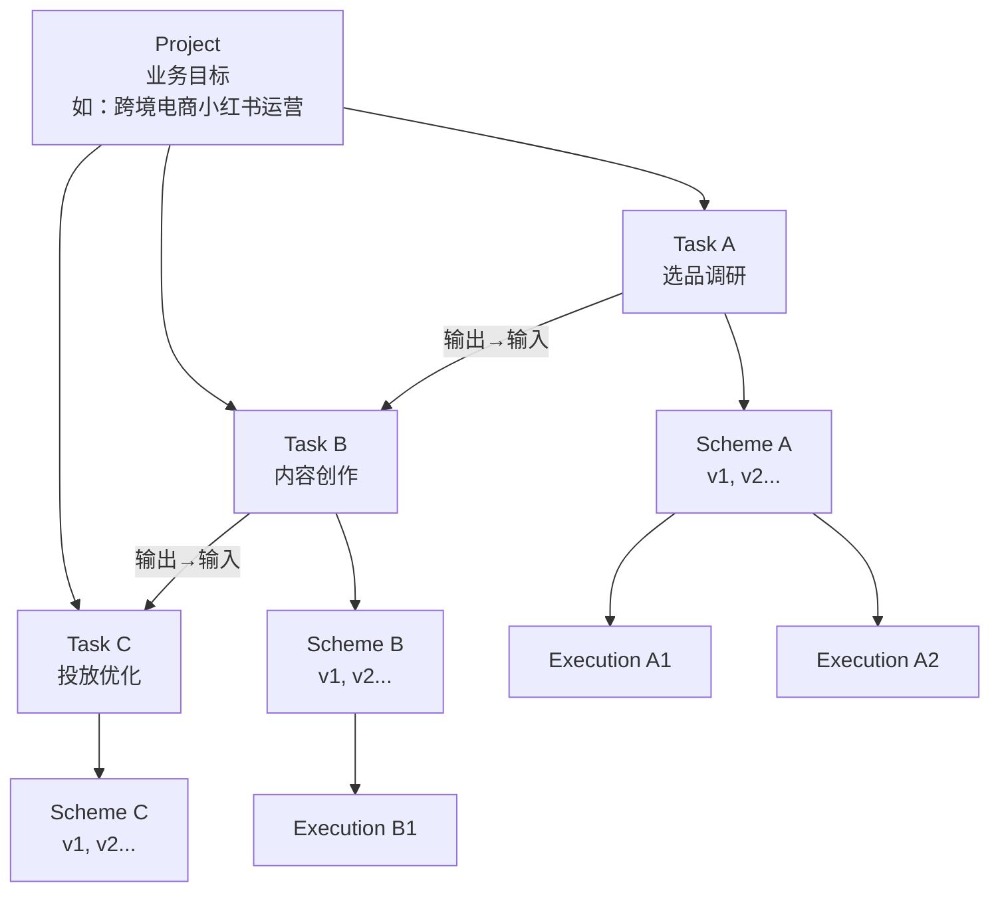

| 层级 | 含义 | 生命周期 |
|------|------|---------|
| **Project** | 业务目标，管理跨 Task 依赖、全局资源、环境假设 | 月级 |
| **Task** | 子目标，对应一个方案 | 周级 |
| **Scheme** | 方案，可以有多个版本（v1, v2...） | 天级 |
| **Execution** | 方案的一次执行实例，有独立的执行轨迹和评估结果 | 小时级 |

### 6.2 Task 之间的依赖与质量契约

Task 之间不只传数据，还传 Context Package（data + quality_signals + assumptions + trace）。

```
Task A → B 的质量契约：
  "调研报告必须包含情感标签，不能只有数据指标"
  "样本量 ≥ 50 个品牌"

Task B → C 的质量契约：
  "内容素材必须包含竖版封面图"
  "每篇内容必须标注目标人群标签"
```

Workflow 的质量契约是设计时预定义的（"编译时"确定），Agentic 的质量契约是运行时逐步发现 + 复盘后固化的（"运行时"学习）。

### 6.3 Project 层的价值

| 没有 Project 层 | 有 Project 层 |
|----------------|--------------|
| Task 各自独立，跨 Task 失败无法追溯 | 跨 Task 级联失败可追溯到上游 |
| 预算、目标分散在各 Task，难以全局管控 | Project 级统一管控资源和目标 |
| 环境假设各 Task 重复定义，可能不一致 | 环境假设在 Project 级统一定义和监控 |
| 业务事件只能逐个 Task 处理 | 业务事件在 Project 级统一评估影响、分发调整 |

### 6.4 运行时三类事件

| 事件类型 | 触发来源 | 特点 | 响应目标 |
|---------|---------|------|---------|
| **异常事件** | 系统自动检测 | 被动、防御性 | 止损、归因、修复 |
| **环境事件** | 环境监控 | 被动、适应性 | 感知、诊断、调整策略 |
| **业务事件** | 人（管理者） | 主动、自带意图 | 理解意图、评估全局影响、分层调整 |

三类事件都走统一链路：**到达 → 意图理解 → 影响评估 → 分层调整 → 人确认 → 生效 → 验证 → 沉淀**。

业务事件（如"追加 10 万预算"）可能穿透全部四层热更新：

```
预算追加
  → Layer 1（约束）：预算上限变更
  → Layer 2（策略）：从纯内容转向内容+投放
  → Layer 3（能力）：需新增"付费投放" Skill
  → Layer 4（编排）：需增加付费投放并行路径
```

> 完整设计见 [`flowagent-product.md`](./flowagent-product.md) 3.2.7 和 4.4。

---

## 七、演进路径

### 7.1 三阶段 x 六子系统

|  | Context OS | Skill Fabric | Design Studio | Execution Kernel | Governance | Learning Flywheel |
|--|-----------|-------------|--------------|-----------------|------------|-------------------|
| **阶段一**（当前） | 概念设计 | 架构设计 + 8 Mock Skill | Demo 可用（AI翻译+编辑+确认） | 规划中 | 基本原则 | 手动 few-shot |
| **阶段二**（1-3 月） | 前端分层管理 + API | Skill 检索 + schema 校验 | 后端 + 用户系统 + 知识参考 | 基础版（试运行 + 配置外化） | 四级角色权限 | Gene 数据模型 + 手动蒸馏 |
| **阶段三**（3-6 月） | 事件驱动架构 | Skill 市场 + 社区生态 | 编译层 + 发布中心 + 业务方自助 | 生产版（调度层 + 约束引擎） | PII + 沙箱 + Trace | 自动 Gene 循环 |

### 7.2 阶段跳板

**阶段一 → 阶段二**的关键跳板：**知识积累**。当已确认方案达到一定数量后，AI 生成质量显著提升。

**阶段二 → 阶段三**的关键跳板：**Skill 标准化**。当 Skill 平台的 I/O schema 足够完善时，编译层可以自动生成可执行定义。

### 7.3 各阶段用户体验

| 阶段 | 业务方 | 技术方 |
|------|--------|--------|
| **一** | 口述需求，技术方代操作 | 在 FlowAgent 生成+修正方案，确认后参考蓝图搭建 |
| **二** | 自己输入需求，看方案后提反馈，试运行体验效果 | 快速审核（大部分决策已被知识覆盖），标注异常归因 |
| **三** | 常见场景直接匹配模板，改配置就能用 | 维护引擎模板和 Skill，处理复杂异常 |

---

## 八、关键设计决策索引

以下决策散落在多轮对话和多份文档中，此处集中索引。

### 8.1 架构决策

| 决策 | 理由 | 出处 |
|------|------|------|
| 自建执行层，不依赖 Dify/LangGraph | 数据闭环（运行数据直接反哺知识）+ 配置外化（按产品需求设计）+ 演进自由度 | `product-matrix.md` 3.1 |
| Skill = 最小业务验收单元 | 业务方能看懂输出、能判断对不对，而非最小技术单元 | `skill-architecture-thinking.md` 第三章 |
| Gene 双形态（Human Doc + Model Gene） | EvoMap 实验表明完整文档注入模型反而降低性能，~230 token Gene 稳定胜出 | `skill-architecture-thinking.md` 5.3 |
| Context Package 携带 quality_signals | 防止级联失败——上游质量不够时在交接点拦截，不等到下游失败 | `context-architecture.md` 第四章 |
| 参数可以热调，结构必须版本化 | Layer 1-2 热更新不违反版本控制，参数调整有独立审计轨迹 | `flowagent-product.md` 3.2.7 |
| 方案蓝图定位（不直接执行） | AI 生成工作流 5 步成功率仅 59%，10 步降至 35%；必须有人审核 | `flowagent-product.md` 4.1 |

### 8.2 执行模型决策

| 决策 | 理由 | 出处 |
|------|------|------|
| Hybrid 双引擎（Workflow + Agentic） | 80% 流程需要确定性，20% 需要灵活性，纯 Agentic 不可控 | AOI 第七章 + `flowagent-product.md` 3.2.1 |
| LLM 不拥有最终执行权 | 企业级场景必须有约束边界，Constrained Planning | AOI 4.3 |
| Workflow 的 Skill 是绑定，Agentic 的 Skill 是授权 | 两种关系的用户决策、决定时机、Agent 自主性完全不同 | `skill-architecture-thinking.md` 第十章 |
| 三种人机协作模式 | Human in the loop（节点级）/ on the loop（策略级）/ Intervention（参数级）覆盖全场景 | `flowagent-product.md` 2.2.2 |

### 8.3 产品决策

| 决策 | 理由 | 出处 |
|------|------|------|
| 当前阶段核心用户是技术方 | AI 方案不保证正确，业务方缺乏判断力，技术方能纠错 | `flowagent-product.md` 1.1 |
| 反问不拦截，改为标记提醒 | 用户没看到方案就被迫回答细节问题，缺乏掌控感 | `flowagent-product.md` 1.1.2 |
| 双角色协作 | 企业现实是业务方和技术方两拨人，信息鸿沟是最大瓶颈 | `flowagent-product.md` 13.2 |
| 知识容器是核心壁垒 | 工具能力可替代，沉淀的企业私有知识不可替代 | `product-strategy.md` 第一章 |

### 8.4 上下文与数据决策

| 决策 | 理由 | 出处 |
|------|------|------|
| 六层上下文模型 | 不同层级生命周期、作用域、消费者完全不同，不能一锅煮 | `context-architecture.md` 第二章 |
| Gene 注入总预算 ≤ 500 token | 控制 LLM 推理预算，优先级：通用 > 组合 > 场景 > Skill | `context-architecture.md` 9.3 |
| 组合 Gene（v13 新增） | 跨节点失败比单节点失败更难发现和修复，需要专门的经验沉淀 | `context-architecture.md` 第五章 |
| 质量传导层默认策略 warn | 已有人工确认节点兜底；不可逆操作的交接用 strict | `context-architecture.md` 9.2 |

---

## 九、与 AOI 框架的映射

### 9.1 子系统对应关系

| AOI 子系统 | 我们的对应 | 覆盖情况 |
|-----------|-----------|---------|
| Context OS | Context Bus + 六层模型 | 已覆盖，更精细（六层 vs 三层） |
| Skill Fabric | Skill 平台 | 已覆盖，Gene 双形态是独有亮点 |
| Execution Kernel | 执行引擎（Workflow + Agentic） | 基本覆盖，需补约束引擎和调度层 |
| Safety & Audit Fabric | Governance Fabric | **主要缺口**——原则有但架构缺 |
| Learning Flywheel | Learning Flywheel | 已覆盖，Gene 机制比 Golden Dataset 更先进 |

### 9.2 我们的差异化

| 差异点 | 说明 |
|--------|------|
| **Gene 双形态** | 基于实验数据的高密度控制资产，而非传统的 Golden Dataset |
| **业务可验收的 Skill 粒度** | 以业务方能理解为边界，而非以技术单元为边界 |
| **Context Package 质量传导** | 事前拦截（上下文交接时校验），而非仅事后追溯（Trace Graph） |
| **双角色协作** | 市面上唯一同时服务业务方和技术方的 Agent 设计平台 |
| **产品化落地** | 不只是架构框架，而是有具体用户体验和产品功能的产品套件 |

### 9.3 从 AOI 引入的补全项

| 补全项 | 来源 | 纳入位置 | 状态 |
|--------|------|---------|------|
| 约束引擎（Task DAG + 状态机 + Policy DSL） | AOI 4.2 | 3.4 Execution Kernel | 规划中 |
| PII 脱敏网关 | AOI 5.1 | 3.5 Governance Fabric | 规划中 |
| Agent/Skill 四维授权 + Capability Token | AOI 5.1 | 3.5 Governance Fabric | 规划中 |
| 执行沙箱（容器 + 微 VM） | AOI 5.1 | 3.5 Governance Fabric | 规划中 |
| 全链路 Trace + 四元版本绑定 | AOI 6.1-6.2 | 3.5 Governance Fabric | 规划中 |
| Rule Judge + LLM Judge 双评估器 | AOI 8.5 | 3.6 Learning Flywheel | 规划中 |
| 设计定义编译层 | 工程架构图 | 3.3 Design Studio | 规划中 |
| 执行调度层（Scheduler/Queue/DLQ） | 工程架构图 | 3.4 Execution Kernel | 规划中 |
| 发布中心（草稿→测试→灰度→生产→回滚） | 工程架构图 | 3.3 Design Studio | 规划中 |

---

## 十、文档体系

```
architecture-panorama.md          ← 你在这里（架构北极星）
    │
    ├── product-matrix.md          四件套定位和关系
    │
    ├── flowagent-product.md       FlowAgent PRD（功能细节）
    │     └── prompt-architecture.md    Prompt 设计
    │
    ├── context-architecture.md    上下文架构（六层模型 + 流动 + 压缩）
    │
    ├── product-strategy.md        知识容器 + Gene 进化 + 竞争壁垒
    │
    ├── skill-architecture-thinking.md   Skill 平台架构
    │
    └── flowagent-architecture.md  代码级技术架构
```

**阅读顺序建议**：

1. 本文档（全景理解）
2. `product-matrix.md`（四件套关系）
3. `flowagent-product.md`（功能细节）
4. `context-architecture.md`（上下文深度设计）
5. `skill-architecture-thinking.md`（Skill 深度设计）
6. `product-strategy.md`（战略思考）

**更新规则**：
- 新的设计决策先在本文档第八章记录
- 然后更新对应的子文档
- 子文档之间的交叉引用通过 Markdown 链接维护
