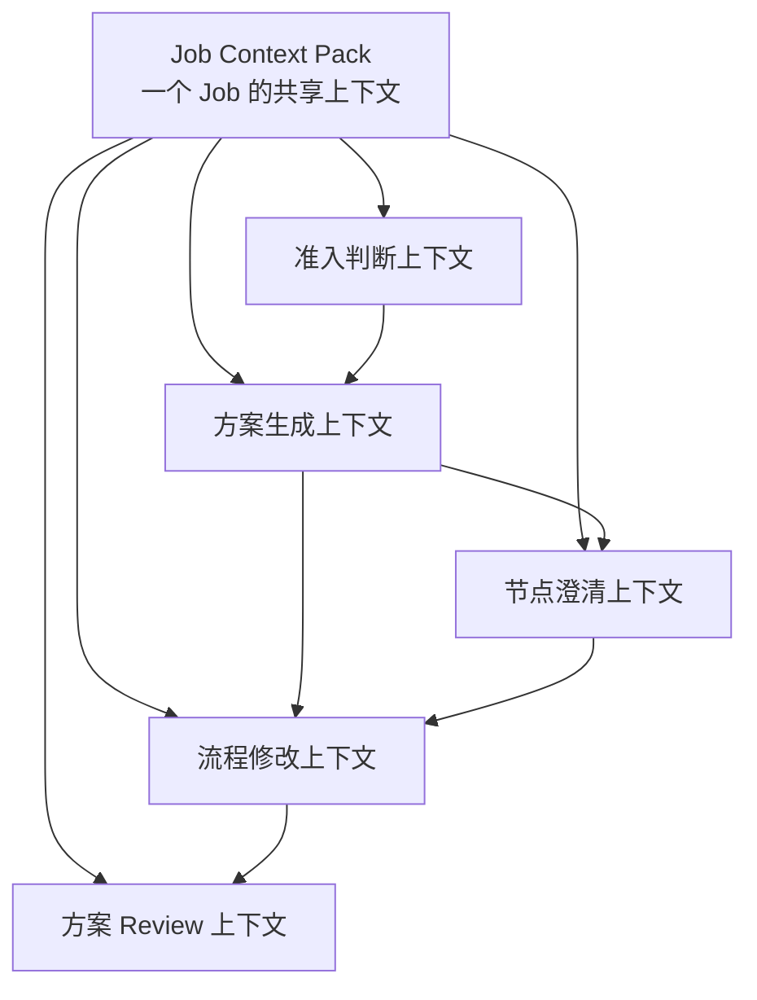

# 流程澄清助手上下文架构

> 版本：2026-05-18
>
> 这份文档描述统一业务展现方式后的流程澄清助手上下文架构。它面向产品设计、Prompt 设计和后续实现讨论。

## 1. 一句话定义

流程澄清助手不是一个单纯生成流程图的工具，而是一个 Job 内的业务方案翻译 Agent。

它的任务是：

> 把业务老师用文字、文件、语音转写或后续对话表达出来的业务工作，持续整理成一份可编辑、可确认、可交给技术方理解的结构化业务方案。

业务侧不需要感知这个方案到底是 workflow 还是 agentic。统一展现为一张业务流程图，只是在节点内部根据业务性质使用不同字段：

- 固定操作类节点：强调操作步骤、输入输出、完成标准。
- 业务判断类节点：强调判断依据、判断规则、输出结果、确认边界。
- 复盘沉淀类节点：强调复盘对象、观察指标、沉淀产物。

## 2. 核心原则

### 2.1 一个 Job 是一个上下文容器

一个业务方案就是一个 Job。

用户在这个 Job 里说过的话、上传过的文件、回答过的问题、修改过的节点，都应该进入同一个 Job Context Pack。

这意味着用户不需要一次说完整。系统应该允许用户先说一句话、再上传文件、再补充规则、再修改节点。

### 2.2 对业务方统一表达，对系统内部分工

业务方看到的是一个连续的流程澄清助手。

系统内部可以拆成多个能力：

- 准入判断器
- 方案生成器
- 节点澄清器
- 流程修改器
- 方案 Review 器

这些不是五个暴露给用户的产品角色，而是同一个助手在不同任务下组装不同上下文。

### 2.3 修改优先使用 delta，不轻易重生成整图

用户后续和 Agent 交互时，很多话都是对当前方案的局部修改，例如：

- “这一步应该放到后面。”
- “这个其实不是财务做，是客服做。”
- “超过 50 美元才需要主管确认。”
- “把这两个节点合并。”

这类交互应该由流程修改器输出增量修改指令，而不是重新生成整张图。这样可以避免已经确认过的内容被覆盖。

## 3. 总体上下文架构



可以理解为：

```text
Job Context Pack 是总资料夹。

准入判断器：看资料够不够开始。
方案生成器：先整理出第一版业务流程图。
节点澄清器：把某个节点问清楚。
流程修改器：根据用户的话改图。
方案 Review 器：检查整张方案哪里还没讲清楚。
```

## 4. Job Context Pack

Job Context Pack 是所有阶段共享的上下文底座。

它不是一次 Prompt，而是当前 Job 的上下文资产集合。

### 4.1 包含内容

| 上下文内容 | 说明 |
| --- | --- |
| 用户原始描述 | 用户最初如何描述这件业务工作 |
| 后续对话 | 用户后续补充、纠正、回答追问的内容 |
| 上传文件 | 当前 Job 内上传的所有文件 |
| 文件分类 | 流程方案、业务规则和 Know-how、文件模板、待识别 |
| 文件摘要 | Excel 表头、样例行、PDF/Word 摘要、图片/OCR 摘要等 |
| 当前业务流程图 | 当前已经生成或被编辑过的节点和连线 |
| 当前选中节点 | 用户正在查看或编辑的节点 |
| 已回答问题 | 用户已经明确回答过的澄清问题 |
| 未解决问题 | 仍需要业务方确认的问题 |
| 修改历史 | 最近几次用户要求 Agent 修改的内容 |
| Review 结果 | 最近一次方案 Review 的问题和建议 |

### 4.2 文件分类在上下文中的作用

| 文件类型 | 主要用途 | 不应该做什么 |
| --- | --- | --- |
| 流程方案 | 提取流程顺序、业务动作、起止点、角色交接 | 不把所有标题都机械拆成节点 |
| 业务规则和 Know-how | 补充判断规则、例外情况、确认边界、经验口径 | 不直接当成流程步骤 |
| 文件模板 | 提取字段、输入输出、结果格式、表单结构 | 不把模板字段当成业务步骤 |
| 待识别 | 先进入材料池，再由系统辅助判断类型 | 不默认当成规则或流程 |

## 5. 准入判断上下文

### 5.1 目的

准入判断器用于判断当前信息是否足够生成第一版业务方案。

它不是为了拦住用户，而是在生成前做一次轻量预检：

- 当前是不是在描述一件业务工作？
- 有没有基本目标？
- 有没有流程起点或触发条件？
- 有没有关键动作或处理对象？
- 有没有最终交付结果？
- 如果信息不足，最少需要追问什么？

### 5.2 输入上下文

准入判断上下文应该很轻：

| 输入 | 说明 |
| --- | --- |
| 用户最新输入 | 本轮用户说了什么 |
| 原始描述摘要 | 当前 Job 的一句话背景 |
| 文件列表和分类 | 用户上传了哪些材料 |
| 文件摘要 | 只放轻量摘要，不放全文 |
| 是否已有流程图 | 判断是首次生成还是继续修改 |

### 5.3 输出

```json
{
  "taskType": "business_plan",
  "readiness": "enough_to_draft",
  "missing": ["流程起点不明确"],
  "suggestedAction": "generate_draft",
  "question": "这个流程一般从什么事件开始，例如客户提交申请、收到邮件，还是系统生成工单？"
}
```

### 5.4 产品表现

准入判断不一定要显式展示为一个独立步骤。

当信息足够时，直接进入生成。

当信息明显不足时，只问一个最关键的问题，避免用户被一堆表单拦住。

## 6. 方案生成上下文

### 6.1 目的

方案生成器用于生成第一版业务流程图。

这一版不追求完美，重点是让业务方快速看到：

- 系统是否理解了这件事；
- 主要业务动作是否基本对；
- 哪些地方还需要补充。

### 6.2 输入上下文

| 输入 | 说明 |
| --- | --- |
| 用户原始描述 | 用户对业务工作的自然表达 |
| 重要补充对话 | 与业务目标、规则、流程有关的补充 |
| 流程方案类文件摘要 | 流程顺序、节点线索、角色交接 |
| 业务规则类文件摘要 | 判断规则、异常情况、确认边界 |
| 文件模板摘要 | 字段、表头、输入输出格式 |
| 准入判断结果 | 已知缺口和生成建议 |

### 6.3 输出

输出是一张统一的业务流程图：

```json
{
  "planType": "business_solution",
  "projectName": "跨境电商售后处理",
  "nodes": [
    {
      "id": "node-1",
      "label": "识别语言与问题类型",
      "workUnitKind": "business_judgment",
      "description": "判断客户使用语言、售后问题类型和风险程度。",
      "inputs": ["客户消息", "售后工单"],
      "outputs": ["问题类型", "情绪风险等级"],
      "checkRulesText": "无法识别语义、客户情绪极端或涉及投诉升级时，需要转人工澄清。"
    }
  ],
  "edges": [
    {
      "source": "node-1",
      "target": "node-2",
      "label": "识别完成"
    }
  ],
  "questions": [
    {
      "nodeId": "node-1",
      "question": "客户消息目前来自哪些渠道，例如邮件、平台站内信还是客服系统？"
    }
  ]
}
```

### 6.4 生成原则

- 优先相信用户描述和上传材料。
- 文件里没有证据的步骤不要硬补。
- 如果模型觉得缺一步，应放进追问，而不是直接新增节点。
- 模板文件主要用于输入输出字段，不直接拆成步骤。
- 规则文件主要用于判断规则和确认边界，不直接拆成步骤。
- 不向业务方暴露 workflow / agentic 标签。

## 7. 节点澄清上下文

### 7.1 目的

节点澄清器用于把一个节点讲清楚。

它回答的问题是：

> 当前这个业务节点，还缺哪些信息才能让业务方确认、让技术方理解？

### 7.2 输入上下文

节点澄清上下文不应该塞整份 Job，而应该围绕当前节点收缩：

| 输入 | 说明 |
| --- | --- |
| 当前选中节点 | 节点名称、说明、输入、输出、规则、完成标准 |
| 上游节点 | 当前节点从哪里来 |
| 下游节点 | 当前节点处理完去哪里 |
| 当前节点空字段 | 哪些字段还没有填写 |
| 相关文件片段 | 与这个节点相关的流程、规则或模板片段 |
| 最近对话 | 用户最近围绕这个节点说过什么 |

### 7.3 输出

节点澄清器输出的是补全建议和追问，不是整图修改。

```json
{
  "nodeId": "node-2",
  "missingFields": ["判断依据", "确认边界"],
  "inferredFromMaterials": [
    "模板中出现订单号、照片、付款截图字段，说明该节点可能需要核对材料完整性。"
  ],
  "questions": [
    "哪些材料缺失时必须让客户补充？",
    "哪些情况需要客服主管确认？"
  ],
  "suggestedPatch": {
    "inputs": ["订单号", "照片", "付款截图"],
    "outputs": ["所需补充材料"]
  }
}
```

### 7.4 产品表现

适合出现在：

- 节点详情里的“帮我完善这个节点”；
- 节点旁边的追问气泡；
- 左侧聊天里的节点级补充建议。

## 8. 流程修改上下文

### 8.1 目的

流程修改器用于根据用户自然语言修改当前业务流程图。

它处理的不是“还缺什么”，而是“用户刚刚这句话应该怎么改图”。

典型输入包括：

- “这个顺序不对。”
- “中间还要加一步主管确认。”
- “这个节点应该叫补齐材料。”
- “这一步不用系统判断，是人工看。”
- “把这两个节点合并。”
- “超过 50 美元才升级。”
- “刚刚那个文件是模板，不是规则。”

### 8.2 输入上下文

| 输入 | 说明 |
| --- | --- |
| 用户最新一句话 | 本轮修改意图 |
| 当前完整流程图 | 用于定位修改对象 |
| 当前选中节点 | 如果用户正在看某个节点，优先作为修改目标 |
| 最近几轮对话 | 判断“这个”“那一步”指代什么 |
| 上传文件分类 | 如果用户在纠正文件类型，需要修改材料分类 |
| 未解决问题 | 避免误把待确认内容当成事实 |

### 8.3 输出

流程修改器应该优先输出 delta，而不是完整重生成。

```json
{
  "intent": "update_node",
  "changes": [
    {
      "nodeId": "node-2",
      "field": "owner",
      "value": "客服专员"
    },
    {
      "nodeId": "node-2",
      "field": "checkRulesText",
      "value": "超过 50 美元、客户投诉升级或政策外补偿时，需要主管确认。"
    }
  ],
  "reply": "我已把这一步的处理人改成客服专员，并补充了升级确认规则。"
}
```

### 8.4 可支持的修改类型

| 修改类型 | 例子 |
| --- | --- |
| 新增节点 | “中间加一步主管确认。” |
| 删除节点 | “这个环节我们实际没有。” |
| 合并节点 | “查询状态和推荐处理方案可以放一起。” |
| 拆分节点 | “补材料和判断是否退款是两件事。” |
| 调整顺序 | “先查订单，再判断问题类型。” |
| 修改字段 | “这一步负责人是客服，不是财务。” |
| 修改规则 | “超过 50 美元才升级。” |
| 修改连线 | “投诉升级后直接进入主管确认。” |
| 重新分类文件 | “这个 Excel 是申请模板，不是规则。” |

## 9. 方案 Review 上下文

### 9.1 目的

方案 Review 器用于检查整份业务方案有没有讲清楚。

它不是重新生成方案，而是站在业务方和技术方之间检查：

- 哪些节点太空；
- 哪些输入输出断了；
- 哪些规则没说清；
- 哪些责任人不明确；
- 哪些地方需要人工确认；
- 哪些地方上传文件和流程图不一致。

### 9.2 输入上下文

| 输入 | 说明 |
| --- | --- |
| 当前完整流程图 | 全部节点和连线 |
| 全部节点字段 | 说明、输入、输出、规则、完成标准 |
| 上传文件分类 | 判断文件是否支撑当前方案 |
| 未解决问题 | 哪些问题还没回答 |
| 用户已确认内容 | 避免重复质疑已确认内容 |
| 最近修改记录 | 判断是否有修改后遗留问题 |

### 9.3 输出

```json
{
  "summary": "整体流程已经能表达主要业务动作，但部分判断规则和输入输出还需要补充。",
  "issues": [
    {
      "severity": "high",
      "nodeId": "node-3",
      "title": "补充材料节点缺少完成标准",
      "detail": "目前只写了需要补材料，但没有说明补齐到什么程度可以进入下一步。"
    },
    {
      "severity": "medium",
      "nodeId": "node-5",
      "title": "退款升级规则不完整",
      "detail": "已写超过 50 美元需要确认，但没有说明投诉升级和政策外补偿怎么处理。"
    }
  ],
  "suggestedQuestions": [
    "补充材料节点需要哪些材料才算齐全？",
    "投诉升级是否一定需要主管确认？"
  ]
}
```

### 9.4 产品表现

适合做成编辑器顶部按钮：方案 Review。

Review 结果应该像体检报告，而不是又生成一版新方案：

- 先告诉用户整体是否可用；
- 再指出关键缺口；
- 支持一键跳转到问题节点；
- 支持把建议转成节点修改。

## 10. 五类上下文的边界

| 能力 | 回答的问题 | 是否改图 | 典型输出 |
| --- | --- | --- | --- |
| 准入判断器 | 现在够不够开始？ | 否 | 生成/追问/等待材料 |
| 方案生成器 | 第一版业务方案长什么样？ | 是，创建整图 | 节点、连线、初始问题 |
| 节点澄清器 | 这个节点还缺什么？ | 可建议，不直接大改 | 节点问题、补全建议 |
| 流程修改器 | 用户这句话要怎么改图？ | 是，局部 delta | 新增、删除、改字段、改连线 |
| 方案 Review 器 | 整体方案哪里还不清楚？ | 否 | 问题清单、风险、建议 |

## 11. 推荐的 Prompt 组装方式

### 11.1 准入判断 Prompt

```text
你是业务方案准入判断器。
你的任务不是生成流程图，而是判断当前 Job 信息是否足够生成第一版业务方案。

你会看到：
- 用户最新输入
- 当前 Job 的简要背景
- 上传文件列表和分类
- 文件摘要

请输出：
- 是否属于业务方案整理需求
- 是否足够生成草稿
- 如果不足，最关键缺什么
- 下一步建议
```

### 11.2 方案生成 Prompt

```text
你是业务方案生成器。
你的任务是把用户描述和 Job 材料整理成一张业务方能看懂的业务流程图。

注意：
- 不向用户暴露 workflow / agentic 分类。
- 有文件时，优先尊重文件里的业务证据。
- 流程方案文件提供节点和顺序线索。
- 业务规则文件提供判断规则和确认边界。
- 文件模板提供输入输出字段和结果格式。
- 文件里没有证据的步骤不要硬补，放入追问。

请输出：
- 项目名称
- 节点和连线
- 每个节点的说明、输入、输出、操作步骤或判断口径
- 需要业务方确认的问题
```

### 11.3 节点澄清 Prompt

```text
你是节点澄清器。
你的任务是围绕当前节点判断它是否讲清楚，并提出补全建议。

你会看到：
- 当前节点
- 上下游节点
- 与当前节点相关的文件片段
- 用户最近关于该节点的补充

请输出：
- 当前节点缺哪些信息
- 哪些可以从材料推断
- 哪些必须向业务方确认
- 可以建议补充到节点里的字段
```

### 11.4 流程修改 Prompt

```text
你是流程修改器。
你的任务是理解用户最新一句话，并把它转换成对当前业务流程图的局部修改。

注意：
- 优先输出 delta 修改，不要重生成整张图。
- 只修改用户明确要求或强烈指向的内容。
- 如果指代不清，先提出一个确认问题。
- 不要覆盖用户已经确认过的内容。

请输出：
- 用户修改意图
- 目标节点或目标文件
- 修改指令列表
- 给用户的简短回复
```

### 11.5 方案 Review Prompt

```text
你是业务方案 Review 器。
你的任务是检查当前业务方案是否足够清楚、完整、可交付。

你不是重新生成方案，而是找问题。

请重点检查：
- 节点是否太空
- 输入输出是否断裂
- 判断规则是否清楚
- 人工确认点是否明确
- 上传文件是否被正确使用
- 是否还有未解决问题

请输出：
- 总体评价
- 问题清单
- 建议追问
- 可一键修复的建议
```

## 12. 当前优先级建议

当前阶段不需要先做技术方案翻译器。

建议优先落地这三件事：

1. 稳定 Job Context Pack：让文字、文件、追问、修改都归到同一个 Job。
2. 做好流程修改器：让用户自然语言改图时只产生 delta，不重生成整图。
3. 做好方案 Review：让用户能知道这份业务方案哪里还没讲清楚。

这样用户才能明显感受到：

- 上传文件有用；
- 和助手对话能持续改进方案；
- 生成的不是一次性结果，而是一份可以逐步澄清和确认的业务方案。
