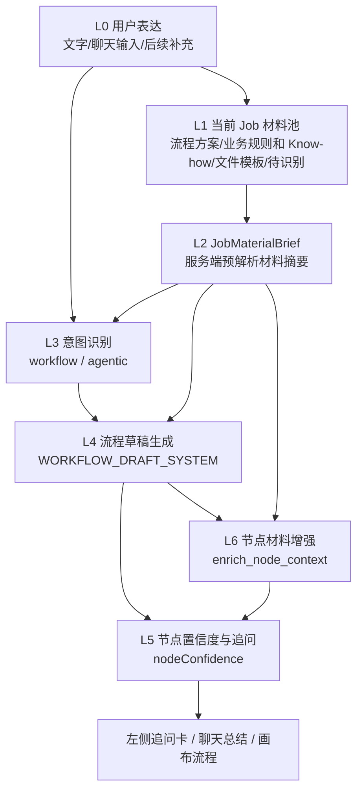

# 流程澄清助手上下文架构

> 这份文档描述当前代码里已经形成的上下文链路，用于产品设计、Prompt 设计和后续架构讨论。

## 一句话定义

流程澄清助手不是单纯把一句话变成流程图，而是把用户表达和当前 Job 的材料一起翻译成结构化业务流程，并在节点级别补充置信度、追问和材料依据。

当前链路可以概括为：

## L0：用户表达层

用户可以通过自然语言描述业务流程，也可以在聊天中继续补充说明。

这一层的特点是：

- 用户不一定知道完整流程。
- 用户可能只上传文件，不写详细描述。
- 用户可能通过一句话表达目标，例如“请整理一下 IMI 证书申请流程”。
- 用户后续可以继续通过聊天修正流程、补充材料或回答追问。

## L1：当前 Job 材料池

上传的文件属于当前业务方案，也就是当前 Job，不是全局知识库。

当前材料分类有四类：

- 流程方案：SOP、流程图、操作手册、Excel 里的流程说明。
- 业务规则和 Know-how：校验规则、审批口径、经验判断、注意事项。
- 文件模板：申请表、Excel 模板、证书样例、系统导入模板。
- 待识别：用户不确定分类时先上传，由系统根据内容辅助判断。

代码中当前用 `jobMaterials` 保存当前 Job 的材料。首页进入编辑器时，也会按本次请求的 `t` 临时保存和恢复，避免刷新或重新生成时丢失材料上下文。

## L2：材料理解层 JobMaterialBrief

服务端不会直接把原始文件全部塞进 Prompt，而是先生成一层轻量摘要：`JobMaterialBrief`。

它包含：

- `fileName`：文件名。
- `category`：材料分类。
- `fileType`：文件类型。
- `summary`：内容摘要。
- `processHints`：可作为流程步骤的线索。
- `ruleHints`：可作为业务规则或 Know-how 的线索。
- `templateFields`：模板字段。
- `sampleRows`：样例行。
- `parseStatus`：解析状态。

当前解析能力：

- Excel：读取前几个 sheet、列头、样例行、流程线索。
- CSV/TSV：读取列头和样例行。
- TXT/MD/JSON：读取文本摘要和关键行。
- PDF：提取文字摘要。
- Word：目前标记为已上传，正文 quick brief 暂不完整解析。
- 图片：目前标记为已上传，暂不做 OCR。

## L3：意图识别层

生成前会先判断任务类型：

- `workflow`：确定性流程、SOP、申请流程、审批流程、资料流转。
- `agentic`：持续运行型目标、多阶段经营、监控、策略调整、周期性执行。

意图识别不仅看用户文字，也会看 `JobMaterialBrief`。

这意味着：如果用户只说“帮我整理一下这个流程”，但上传了流程 Excel 或流程图 PDF，系统仍然应该能判断为 workflow。

## L4：流程草稿生成层

如果识别为 workflow，会进入 `WORKFLOW_DRAFT_SYSTEM`。

当前 Prompt 的核心原则是：

- 有文件时，文件就是真相。
- 如果 JobMaterialBrief 中有“流程方案”的 `processHints`，流程节点必须优先来自这些线索。
- 不要因为业务名称像“证书申请/审批/评审”就自行补充官方审批节点。
- 禁止新增材料或用户描述中没有出现的节点，例如“形式审查”“实质评审”“专家评审”“现场核查”“受理通知书”等。
- 如果模型认为流程缺一步，但材料里没有证据，应放到追问里，而不是直接生成节点。
- 文件模板只作为输入、输出或字段依据，不拆成流程步骤。
- 业务规则和 Know-how 只作为节点说明、判断口径或追问依据，不直接拆成流程步骤。

输出包含两部分：

- `flow`：流程图结构。
- `nodeConfidence`：节点置信度和追问。

## L5：节点置信度与追问

每个节点会生成一个置信度：

- `high`：描述或材料已经足够清楚，不需要追问。
- `medium`：节点基本成立，但有局部口径需要确认。
- `low`：节点可能成立，但缺少关键业务信息。

追问必须绑定具体节点，避免泛泛地问“还有什么特殊要求吗”。

典型追问场景：

- 某一步责任人不明确。
- 某个文件是输入还是输出不明确。
- 某个判断标准只在规则材料里提到，但流程里没有说明如何使用。
- 用户描述和上传材料存在冲突。

## L6：节点材料增强层

流程图生成后，如果当前 Job 有上传材料，会额外调用 `enrich_node_context`。

这一层不会修改流程结构，只负责给节点补充：

- `attachedMaterials`：这个节点关联哪些材料。
- `relatedRules`：哪些业务规则影响这个节点。
- `confidence`：材料视角下的置信度。
- `questions`：还需要业务确认的问题。

它的作用是让上传文件的价值变得可见：不是只影响生成结果，而是能说明“这个节点为什么这样生成、依据来自哪里、哪里还不确定”。

## 当前用户体验

现在用户能感受到的链路是：

1. 上传材料时可以选择材料分类。
2. 生成流程时，文件会进入当前 Job 上下文。
3. 流程草稿会尽量锚定流程方案材料。
4. 左侧聊天会展示生成进度和结果摘要。
5. 如果材料增强识别到问题，会进入节点追问卡。

## 当前缺口

当前还没有完全做好的地方：

- 节点材料依据主要体现在聊天总结和追问里，还没有稳定展示到右侧节点卡片。
- Word 和图片材料的 quick brief 解析还不完整。
- “待识别”材料还只是交给模型判断，没有在 UI 上形成后续分类确认。
- 流程草稿和材料增强是两次调用，材料依据会稍后补充，不是第一屏立即完整展示。
- 当前材料池是前端状态加 session 恢复，还不是正式的服务端 Job 存储。

## 下一步建议

优先做“节点证据可视化”。

也就是把 `enrich_node_context` 返回的内容沉淀到节点数据里，并在节点卡片或右侧详情里展示：

- 关联材料。
- 相关规则。
- 置信度原因。
- 还需要业务确认的问题。

这样用户才能明确感受到：上传文件之后，流程不是“更长”或“更复杂”，而是更有依据、更少幻觉、更少无效追问。
