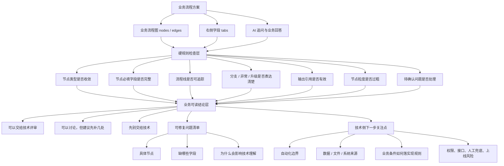

# 方案 Review 组成说明

## 1. 定位

方案 Review 不是“系统盖章通过”，也不是技术方案评审。

它的作用是：在业务方把流程交给技术方之前，检查这份业务表达是否足够清楚，避免技术方因为节点类型、字段缺失、分支表达不清、资料来源不明而误解或返工。

一句话：

> 方案 Review 判断的是“这份业务图能不能进入技术讨论”，不判断“技术上能不能做、成本多高、是否允许上线”。

## 2. 组成图



## 3. 输入

| 输入 | 来源 | 用途 |
| --- | --- | --- |
| `businessFlow.nodes` | 业务流程图 JSON | 检查每个业务节点是否有足够信息 |
| `businessFlow.edges` | 业务流程图 JSON | 检查主流程、分支、回路是否清楚 |
| 右侧基础字段 | 节点详情 tab | 检查节点说明、输入、输出 |
| `sopSpec` | SOP 型节点第三个 tab | 检查操作步骤和业务规则 |
| `strategySpec` | 策略型节点第三个 tab | 检查判断依据、判断流程、异常/升级条件 |
| AI 追问状态 | 澄清对话 | 检查是否还有业务问题未回答 |

## 4. 硬规则检查层

### 4.1 节点类型是否收敛

业务侧 MVP 只接受两类节点：

| 类型 | 含义 |
| --- | --- |
| `sop_step` | 有相对固定做法的操作步骤 |
| `strategy_step` | 需要按依据做判断、分支、升级的策略步骤 |

业务图里不再保留路由节点。条件分支通过连线标签、节点输出、策略字段表达。

### 4.2 节点必填字段是否完整

Review 不应该只提示“有 6 个节点不完整”，必须指出具体节点和具体字段。

示例：

```text
共 6 个节点需要补字段：
登记申请信息（缺 操作步骤、业务规则）；
核对客户资料（缺 业务规则）；
判断是否续申请（缺 判断流程、异常/升级条件）
```

字段规则：

| 节点类型 | 必填字段 |
| --- | --- |
| SOP 型节点 | 节点说明、输入、输出、操作步骤、业务规则 |
| 策略型节点 | 节点说明、输入、输出、判断依据、判断流程、异常/升级条件 |

### 4.3 流程线是否可追踪

检查内容：

- 每条线的起点和终点节点必须存在
- 线最好有业务含义，例如“资料齐全”“需要补资料”“审批通过”
- 有条件分支时，不能只在节点描述里提到条件，却没有对应的出边表达

### 4.4 分支、异常、升级是否表达清楚

Review 重点看业务侧是否说清楚：

- 什么情况进入下一步
- 什么情况退回补资料
- 什么情况升级人工处理
- 什么情况终止、挂起、循环或重新申请

它不要求业务方设计技术路由节点，但要求业务语义不能丢。

### 4.5 输出引用是否有效

原则：

- `businessFlow.edges` 是流程顺序的唯一权威
- `outputs[].flowsTo` 只作为数据依赖备注
- 如果 `flowsTo` 引用了不存在的节点，需要提示修正

### 4.6 节点粒度是否过粗

如果一个节点描述过长，或者把多个动作塞在一起，Review 应提示业务方检查是否拆分。

示例：

```text
这些节点描述较长，建议检查是否需要拆分：
收集资料并校验客户资质、提交审批并同步结果
```

### 4.7 待确认问题是否处理

如果 AI 追问还没回答，或某些节点用了默认建议，Review 需要提示：

- 哪些问题没答
- 哪些节点依赖默认建议
- 是否允许先按默认口径进入技术讨论

## 5. 业务可读结论层

Review 结果建议分三档：

| 结论 | 含义 | 按钮状态 |
| --- | --- | --- |
| 可以交给技术评审 | 业务表达足够清楚，可以进入技术讨论 | 允许确认方案 |
| 可以讨论，但建议先补几处 | 主线可读，但部分字段、分支或追问可能造成歧义 | 允许继续，但突出待补项 |
| 先别交给技术 | 缺少关键业务信息，直接交付会明显返工 | 禁止确认方案 |

## 6. 页面展示建议

### 6.1 不展示“假绿灯”

不要把所有通过项都平铺成“已具备”。这对业务人员没有行动价值，还会制造“系统已经证明方案正确”的错觉。

建议：

- 通过项只做摘要，例如“已通过 7 项硬规则检查”
- 弹窗主体优先展示有行动价值的内容
- 即使全部通过，也要明确“不代表技术方案已经通过”

### 6.2 有问题时展示可修复清单

每条问题至少包含：

| 信息 | 示例 |
| --- | --- |
| 问题类型 | 每一步是否知道要什么、交付什么 |
| 影响 | 技术方无法判断本步职责 |
| 具体节点 | 登记申请信息、核对客户资料 |
| 缺失字段 | 操作步骤、业务规则 |
| 建议动作 | 去第三个 tab 补齐对应字段 |

### 6.3 无问题时展示交接边界

即使 Review 通过，也应该展示：

- 技术方下一步会判断自动化边界
- 技术方需要确认数据和文件来源
- 技术方需要把业务条件翻译成系统规则
- 技术方仍需评估接口、权限、上线风险和人工兜底

## 7. 不做什么

方案 Review 不做以下判断：

| 不做 | 原因 |
| --- | --- |
| 不判断技术可行性 | 这是技术评审的职责 |
| 不判断系统接口是否存在 | 需要技术侧查看系统和权限 |
| 不判断自动化成本 | 需要结合实现方案、数据质量、异常率 |
| 不替业务确认真实规则 | 只能发现表达缺口，不能替代业务 owner 决策 |
| 不用“全部绿色”代表上线风险低 | 上线风险属于技术、合规、运维共同评估 |

## 8. MVP 规则摘要

```text
输入：业务流程图 + 右侧字段 + AI 追问状态

检查：
1. 节点类型是否只有 sop_step / strategy_step
2. SOP 节点是否有操作步骤和业务规则
3. 策略节点是否有判断依据、判断流程、异常/升级条件
4. 节点是否有说明、输入、输出
5. edges 是否引用有效节点
6. 条件分支是否通过连线或策略字段表达
7. outputs[].flowsTo 是否只引用存在节点
8. 是否还有未回答追问或默认建议

输出：
1. 三档结论
2. 具体问题节点和缺失字段
3. 建议下一步
4. 明确说明这不是技术可行性通过
```

